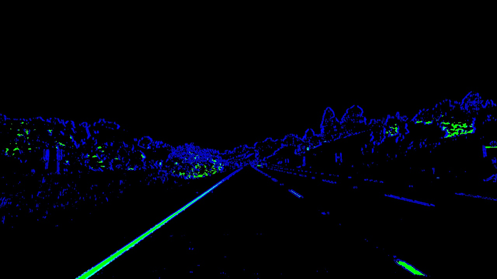
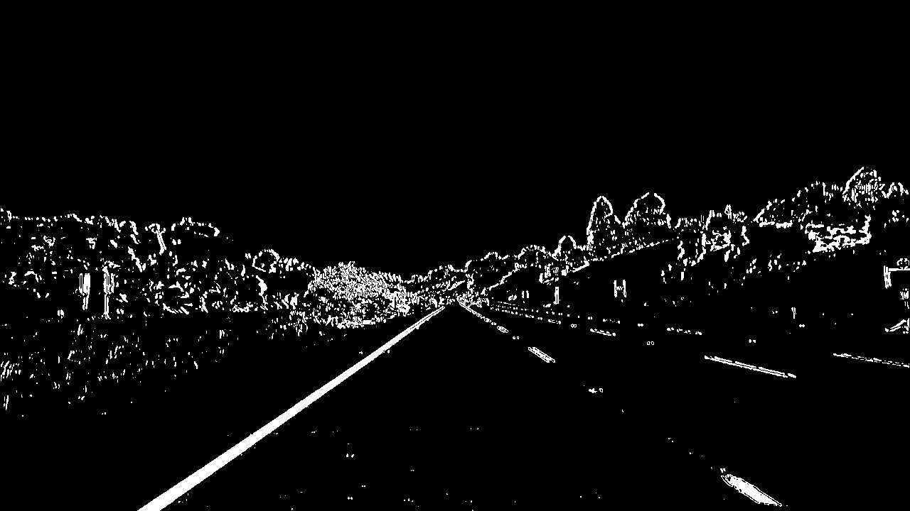

# Advanced Lane Finding Project

The pre-fork README can be found [here](README_ori.md).
This README contains my notes for the project.
The IPython notebooks used for the code can be found [here](advancedLaneFinding.ipynb).
Every code cell, in the notebook, is proceeded with a markup cell that provides
a title for the following cell and will be used to reference the cell in the
following document.

The steps of this project are the following:

* Compute the camera calibration matrix and distortion coefficients given a set of chessboard images.
* Apply a distortion correction to raw images.
* Use color transforms, gradients, etc., to create a thresholded binary image.
* Apply a perspective transform to rectify binary image ("birds-eye view").
* Detect lane pixels and fit to find the lane boundary.
* Determine the curvature of the lane and vehicle position with respect to center.
* Warp the detected lane boundaries back onto the original image.
* Output visual display of the lane boundaries and numerical estimation of lane curvature and vehicle position.

## Camera Calibration

The code cells referenced by the following names in the
[IPython notebook](advancedLaneFinding.html) is used in this section.

  - **Find Chessboard Corners On A Number Of Calibration Images**
  - **Calibrate Camera**
  - **Test Camera Calibration With Images**

I start by preparing "object points", which will be the (x, y, z) coordinates of
the chessboard corners in the world. Here I am assuming the chessboard is fixed
on the (x, y) plane at z=0, such that the object points are the same for each
calibration image. Thus, `objp` is just a replicated array of coordinates, and
`objpoints` will be appended with a copy of it every time I successfully detect
all chessboard corners in a test image. `imgpoints` will be appended with the
(x, y) pixel position of each of the corners in the image plane with each
successful chessboard detection.


I then used the output `objpoints` and `imgpoints` to compute the camera
calibration and distortion coefficients using the `cv2.calibrateCamera()`
function.  I applied this distortion correction to the test image using the
`cv2.undistort()` function and obtained these result:

| Original Image | Undistorted Image | Original Image | Undistorted Image
|:---:|:---:|:---:|:---:|
|  |  |  |  |

## Pipeline (single images)

I used the sobel X gradient thresholds _anded_ with the HLS color space S
channel threshold to generate a binary image in the .  Here's an
example of my output for this step.  (note: this is not actually from one of the
test images)


| sobel x | hls s | x s AND color | x s AND
|:---:|:---:|:---:|:---:|
|  |  |  |  |


####3. Describe how (and identify where in your code) you performed a perspective transform and provide an example of a transformed image.

The code for my perspective transform includes a function called `warper()`,
which appears in lines 1 through 8 in the file `example.py`
(output_images/examples/example.py) (or, for example, in the 3rd code cell of
the IPython notebook).  The `warper()` function takes as inputs an image
(`img`), as well as source (`src`) and destination (`dst`) points.  I chose the
hardcode the source and destination points in the following manner:

```
src = np.float32(
    [[(img_size[0] / 2) - 55, img_size[1] / 2 + 100],
    [((img_size[0] / 6) - 10), img_size[1]],
    [(img_size[0] * 5 / 6) + 60, img_size[1]],
    [(img_size[0] / 2 + 55), img_size[1] / 2 + 100]])
dst = np.float32(
    [[(img_size[0] / 4), 0],
    [(img_size[0] / 4), img_size[1]],
    [(img_size[0] * 3 / 4), img_size[1]],
    [(img_size[0] * 3 / 4), 0]])

```
This resulted in the following source and destination points:

| Source        | Destination   |
|:-------------:|:-------------:|
| 585, 460      | 320, 0        |
| 203, 720      | 320, 720      |
| 1127, 720     | 960, 720      |
| 695, 460      | 960, 0        |

I verified that my perspective transform was working as expected by drawing the `src` and `dst` points onto a test image and its warped counterpart to verify that the lines appear parallel in the warped image.

![alt text][image4]

####4. Describe how (and identify where in your code) you identified lane-line pixels and fit their positions with a polynomial?

Then I did some other stuff and fit my lane lines with a 2nd order polynomial kinda like this:

![alt text][image5]

####5. Describe how (and identify where in your code) you calculated the radius of curvature of the lane and the position of the vehicle with respect to center.

I did this in lines # through # in my code in `my_other_file.py`

####6. Provide an example image of your result plotted back down onto the road such that the lane area is identified clearly.

I implemented this step in lines # through # in my code in `yet_another_file.py` in the function `map_lane()`.  Here is an example of my result on a test image:

![alt text][image6]

---

###Pipeline (video)

####1. Provide a link to your final video output.  Your pipeline should perform reasonably well on the entire project video (wobbly lines are ok but no catastrophic failures that would cause the car to drive off the road!).

Here's a [link to my video result](./project_video.mp4)

---

###Discussion

####1. Briefly discuss any problems / issues you faced in your implementation of this project.  Where will your pipeline likely fail?  What could you do to make it more robust?

Here I'll talk about the approach I took, what techniques I used, what worked and why, where the pipeline might fail and how I might improve it if I were going to pursue this project further.  
